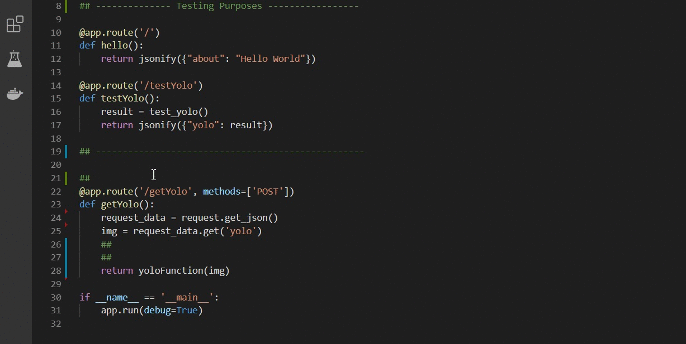

- Ensure that Docker is allocated 7GB memory
- Ensure that yolo2.weights is placed into Yolo folder
- Execute docker-compose up

Frontend    -> localhost:3000
Server      -> localhost:4000
Yolo        -> localhost:5000


[![Contributors][contributors-shield]][contributors-url]
[![Forks][forks-shield]][forks-url]
[![Stargazers][stars-shield]][stars-url]
[![Issues][issues-shield]][issues-url]
[![MIT License][license-shield]][license-url]
[![LinkedIn][linkedin-shield]][linkedin-url]


<!-- PROJECT LOGO -->
<br />
<p align="center">
  <a href="https://github.com/sgtech-ict3104/ict3104-team10-2019">
    
  </a>

  <h3 align="center">ICT 3104-Team 10-2019:Performance Requirement & Testing</h3>

  <p align="center">

  </p>
</p>


<!-- TABLE OF CONTENTS -->
## Table of Contents

* [About the Project](#about-the-project)
  * [Built With](#built-with)
* [Getting Started](#getting-started)
  * [Prerequisites](#prerequisites)
  * [Installation](#installation)

* [System Architecture](#systemarchitecture)
  * [Frontend](#frontend)
  * [YOLO](#YOLO)
  * [Backend](#backend)
* [Usage](#usage)
* [Roadmap](#roadmap)
* [Contributing](#contributing)
* [License](#license)
* [Contact](#contact)
* [Acknowledgements](#acknowledgements)


<!-- ABOUT THE PROJECT -->
## About The Project

[![Product Name Screen Shot][product-screenshot]](https://example.com)

The app be part of a collaborative project between SIT and an industry partner. The main objective is to create a simple Single Page Application (SPA) with the corresponding backend services. 

Here's why:
* Your time should be focused on creating something amazing. A project that solves a problem and helps others
* You shouldn't be doing the same tasks over and over like creating a README from scratch
* You should element DRY principles to the rest of your life :smile:

Of course, no one template will serve all projects since your needs may be different. So I'll be adding more in the near future. You may also suggest changes by forking this repo and creating a pull request or opening an issue.

A list of commonly used resources that I find helpful are listed in the acknowledgements.

### Built With
This section should list any major frameworks that you built your project using. Leave any add-ons/plugins for the acknowledgements section. Here are a few examples.
* [Bootstrap](https://getbootstrap.com)
* [JQuery](https://jquery.com)
* [Laravel](https://laravel.com)


<!-- GETTING STARTED -->
## Getting Started

This is an example of how you may give instructions on setting up your project locally.
To get a local copy up and running follow these simple example steps.

### Prerequisites

This is an example of how to list things you need to use the software and how to install them.
* npm
```sh
npm install npm@latest -g
```

### Installation

1. Get a free API Key at [https://example.com](https://example.com)
2. Clone the repo
```sh
git clone https://github.com/your_username_/Project-Name.git
```
3. Install NPM packages
```sh
npm install
```
4. Enter your API in `config.js`
```JS
const API_KEY = 'ENTER YOUR API';
```

<!-- System Architecture for Understanding -->
## System Architecture 

<p align="center">
  <a href="https://github.com/sgtech-ict3104/ict3104-team10-2019">
    
  </a>

  <h3 align="center">ICT 3104-Team 10-2019:Performance Requirement & Testing</h3>

  <p align="center">

  </p>
</p>

### Frontend

### YOLO
### Flask API
`Flask` is used to provide services for the backend `nodeJS` to call and transmit a byte array through `JSON`.

Once `nodeJS` calls the post method and sends over the `JSON`, the result will be sent to `Flask`, followed by the object detection method.
Afterwards, the result will be returned back to Flask and directly to nodeJS, no storing needed.



<!-- USAGE EXAMPLES -->
## Usage
Usage of `darkflow` in our object detection function.

The byte array passed over from `Flask` will be directly used instead of having the need to `opencv` in the case of an URL.
This will speed up the process and reducing the response time.


Output of object detection:
```sh
[{'label': 'person', 'confidence': 0.3876104, 'topleft': {'x': 991, 'y': 337}, 'bottomright': {'x': 1133, 'y': 442}}, 
{'label': 'truck', 'confidence': 0.16879167, 'topleft': {'x': 221, 'y': 268}, 'bottomright': {'x': 1711, 'y': 732}}, 
{'label': 'car', 'confidence': 0.80724114, 'topleft': {'x': 255, 'y': 281}, 'bottomright': {'x': 1688, 'y': 755}}]
```
 - label: type of object
 - confidence: somewhere between 0 and 1 (how confident yolo is about that detection) 
 - topleft: pixel coordinate of top left corner of box. 
 - bottomright: pixel coordinate of bottom right corner of box.

<!-- ROADMAP -->
## Roadmap

See the [open issues](https://github.com/othneildrew/Best-README-Template/issues) for a list of proposed features (and known issues).


<!-- CONTRIBUTING -->
## Contributing

Contributions are what make the open source community such an amazing place to be learn, inspire, and create. Any contributions you make are **greatly appreciated**.

1. Fork the Project
2. Create your Feature Branch (`git checkout -b feature/AmazingFeature`)
3. Commit your Changes (`git commit -m 'Add some AmazingFeature'`)
4. Push to the Branch (`git push origin feature/AmazingFeature`)
5. Open a Pull Request


<!-- LICENSE -->
## License

Distributed under the MIT License. See `LICENSE` for more information.


<!-- CONTACT -->
## Contact

Your Name - [@your_twitter](https://twitter.com/your_username) - email@example.com

Project Link: [https://github.com/your_username/repo_name](https://github.com/your_username/repo_name)


<!-- ACKNOWLEDGEMENTS -->
## Acknowledgements
* [GitHub Emoji Cheat Sheet](https://www.webpagefx.com/tools/emoji-cheat-sheet)
* [Img Shields](https://shields.io)
* [Choose an Open Source License](https://choosealicense.com)
* [GitHub Pages](https://pages.github.com)
* [Animate.css](https://daneden.github.io/animate.css)
* [Loaders.css](https://connoratherton.com/loaders)
* [Slick Carousel](https://kenwheeler.github.io/slick)
* [Smooth Scroll](https://github.com/cferdinandi/smooth-scroll)
* [Sticky Kit](http://leafo.net/sticky-kit)
* [JVectorMap](http://jvectormap.com)
* [Font Awesome](https://fontawesome.com)


<!-- MARKDOWN LINKS & IMAGES -->
<!-- https://www.markdownguide.org/basic-syntax/#reference-style-links -->
[contributors-shield]: https://img.shields.io/github/contributors/othneildrew/Best-README-Template.svg?style=flat-square
[contributors-url]: https://github.com/othneildrew/Best-README-Template/graphs/contributors
[forks-shield]: https://img.shields.io/github/forks/othneildrew/Best-README-Template.svg?style=flat-square
[forks-url]: https://github.com/othneildrew/Best-README-Template/network/members
[stars-shield]: https://img.shields.io/github/stars/othneildrew/Best-README-Template.svg?style=flat-square
[stars-url]: https://github.com/othneildrew/Best-README-Template/stargazers
[issues-shield]: https://img.shields.io/github/issues/othneildrew/Best-README-Template.svg?style=flat-square
[issues-url]: https://github.com/othneildrew/Best-README-Template/issues
[license-shield]: https://img.shields.io/github/license/othneildrew/Best-README-Template.svg?style=flat-square
[license-url]: https://github.com/othneildrew/Best-README-Template/blob/master/LICENSE.txt
[linkedin-shield]: https://img.shields.io/badge/-LinkedIn-black.svg?style=flat-square&logo=linkedin&colorB=555
[linkedin-url]: https://linkedin.com/in/othneildrew
[product-screenshot]: images/screenshot.png

